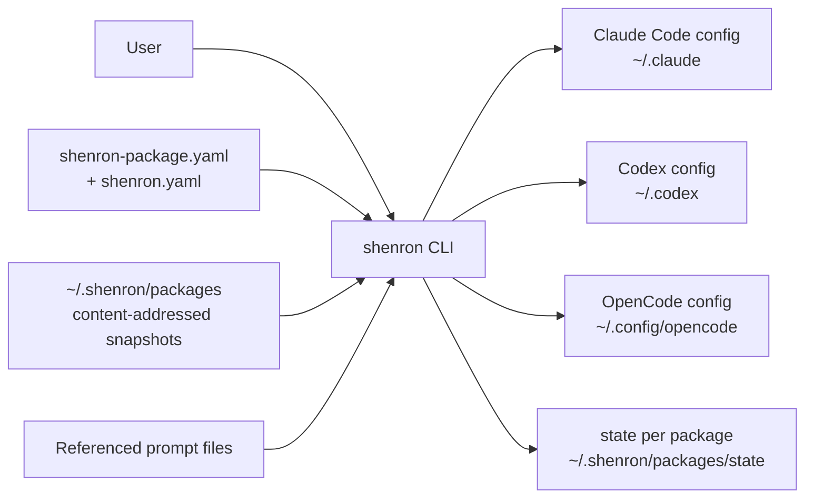
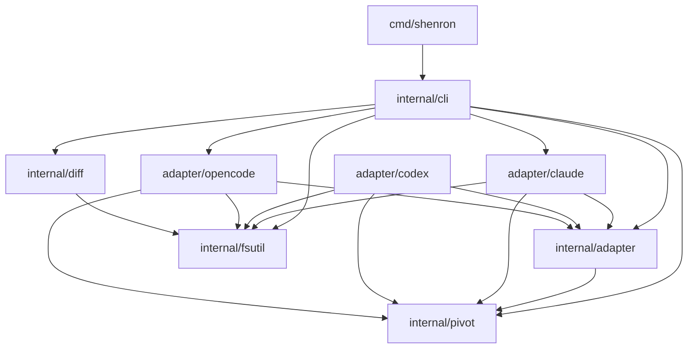
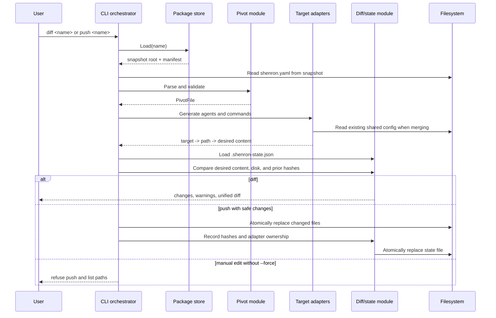

# Shenron Architecture

## Purpose and scope

Shenron is a Go command-line application that treats `shenron.yaml` as the
authoritative, tool-neutral description of coding-assistant agents, commands,
permissions, prompts, and skill references. It validates that pivot model and
renders it into the native configuration formats used by Claude Code, Codex,
and OpenCode.

The system is intentionally one-way:

```text
shenron-package.yaml + shenron.yaml
  -> validated package snapshot in ~/.shenron/packages
    -> target adapters -> native files
                          |
                          v
                  diff and state tracking
```

The pivot is no longer the unit of user-facing distribution. Users ship and
version **packages** (a manifest plus a pivot), and Shenron validates, stores,
and pushes from those packages. Synchronization always flows from a package
snapshot to native files; native files are never read back into a pivot.

## Architectural drivers

- Keep one CLI-neutral source of truth.
- Isolate target-specific formats and permission mappings behind adapters.
- Preview every observable change before writing it.
- Protect native files that users edited after the last successful push.
- Preserve native-only OpenCode configuration while updating managed entries.
- Ship as a single Go binary with no runtime service or database.

## System context



The application accesses local files for the package store and the native
configs. The only network call is `git clone` against public HTTPS remotes
during `shenron install` or `shenron update`. There are no daemons, plugin
loaders, or remote persistence layers.

## Module map

| Module | Responsibility | Main interface |
|---|---|---|
| `cmd/shenron` | Process entry point and root Cobra command | Executable invocation |
| `internal/cli` | Package command construction and sync orchestration | `RunPackageInstall`, `RunPackageList`, `RunPackageUpdate`, `RunPackageDiff`, `RunPackagePush`, `Generate` |
| `internal/cli/sync_runtime.go` | Pivot sync runtime (preflight, diff, write) shared with the package flow | `RunDiff`, `RunPush`, `runDiffAt`, `runPushAt` |
| `internal/package` | Package manifest parsing, validation, install/update lifecycle, store IO | `Store`, `Install`, `Update`, `ValidateGitSource` |
| `internal/pivot` | Pivot schema, YAML parsing, validation | `Parse`, `ParseStrict`, pivot types |
| `internal/adapter` | Seam between the tool-neutral model and target formats | `Adapter` |
| `internal/adapter/claude` | Claude Markdown/frontmatter generation | `adapter.Adapter` implementation |
| `internal/adapter/codex` | Codex TOML custom-agent and Markdown custom-prompt generation | `adapter.Adapter` implementation |
| `internal/adapter/opencode` | OpenCode JSON fragments, ordered merge, and prompt files | `adapter.Adapter` plus fragment accumulation |
| `internal/diff` | Disk comparison, unified output, manual-edit detection, push state | `ComputeDiffs`, `LoadState`, `SaveState` |
| `internal/fsutil` | Configuration paths and atomic replacement | `WriteFileAtomic`, path helpers |

Dependencies point inward toward the pivot model. Target adapters depend on
`internal/pivot`; the pivot module does not know which targets exist.



## Core domain model

`internal/pivot` is the canonical model used by every synchronization path:

- `PivotFile` contains a schema version, agents, commands, and skill references.
- `AgentDefinition` contains identity, role, model selection, temperature,
  prompt source, normalized permissions, target extensions, and skills.
- `CommandDefinition` contains identity, description, template, and optional
  agent/model selection.
- `Permissions` expresses common capabilities with `allow`, `ask`, and `deny`.

Parsing and validation happen together at the pivot seam. Invalid identifiers,
duplicates, missing required values, invalid cross-references, conflicting
prompt sources, missing prompt files, invalid temperatures, and unsupported
permission values are rejected before any target generation or write occurs.

Package loads use `pivot.ParseStrict`, which rejects unknown YAML fields. The
legacy `pivot.Parse` used by the library escape hatch still accepts unknown
fields.

## Synchronization pipeline

`diff <name>` and `push <name>` share the preparation path in
`internal/cli`. Every command operates on a package snapshot under
`~/.shenron/packages/packages/<name>/<active-digest>/`, with state under
`~/.shenron/packages/state/<name>/`:



### Discovery

There is no global pivot lookup. Each `shenron install` argument is either a
local directory path or a `https://` Git URL with an immutable `--ref`
(tag or full commit SHA). The store path under
`~/.shenron/packages/packages/<name>/<digest>/` is content-addressed; the
active digest is recorded in the package index.

### Generation

`cli.Generate` iterates through every selected adapter, then through every pivot
agent and command. Generated files are grouped by adapter so push output and
state ownership remain target-aware.

Two optional internal seams supplement the public `Adapter` interface:

- `pivotDirSetter` supplies the pivot directory for resolving `promptFile`.
- `fragmentAccumulator` lets OpenCode collect fragments that share one JSON
  file before it performs a single merge.

These are discovered with Go type assertions inside the CLI orchestrator.

### Diff and manual-edit protection

For each desired file, `diff.ComputeDiffs` compares:

1. generated content,
2. current disk content, and
3. the SHA-256 hash stored after the last successful push.

If disk differs from both generated content and the last stored hash, the file
is classified as manually modified. `push` refuses to overwrite it unless
`--force` is supplied. Files previously tracked but no longer generated are
classified as orphaned and reported; they are not deleted.

The library `RunDiff`/`RunPush` escape hatch keeps the state file beside the
pivot as `.shenron-state.json`; the package flow instead stores it under
`store.StateDir(name)`, outside the immutable snapshot. Either way it records
the content hash, path, and owning adapter for each written file. Adapter
ownership keeps a targeted push from reporting another target's files as
orphaned.

### Writes

All application-owned writes use `fsutil.WriteFileAtomic`: create parent
directories, write a temporary file in the destination directory, apply the
requested permissions, close it, and rename it over the destination. This
prevents readers from observing partially written configuration.

The state update follows generated-file writes. The operation is safe against
partial file content, but it is not a transaction across all targets: a process
failure after some renames can leave native files updated while the state file
still describes the preceding push.

## Target adapters

The central extension seam is `internal/adapter.Adapter`:

```go
type Adapter interface {
    Name() string
    ValidateAgent(pivot.AgentDefinition) error
    GenerateAgent(pivot.AgentDefinition) (map[string]string, error)
    GenerateCommand(pivot.CommandDefinition) (map[string]string, error)
    TargetPaths() []string
    MergeFile(path string, existing []byte, fragments map[string]any) ([]byte, error)
}
```

This is a relatively deep module interface: callers provide normalized pivot
definitions and receive complete desired files, while format details remain in
the adapter implementations. `internal/cli/registry.go` is the composition root
that constructs and names the concrete adapters.

### Claude Code

The Claude adapter generates independent Markdown files:

- `~/.claude/agents/<id>.md` for agents,
- `~/.claude/commands/<id>.md` for commands.

It maps pivot fields into YAML frontmatter, derives Claude tools and permission
mode from normalized permissions, resolves prompts, and honors Claude-specific
extension overrides. Because each definition owns a standalone file,
`MergeFile` returns no merged content.

### OpenCode

The OpenCode adapter generates:

- prompt bodies under `~/.config/opencode/prompts/`,
- command bodies under `~/.config/opencode/command/`, and
- agent/command fragments merged into `opencode.json`.

It accumulates JSON fragments during generation, then performs one ordered
merge. Its `orderedObject` implementation preserves existing key order and raw
values while upserting managed `agent` and `command` entries. Unrelated
top-level keys and native-only nested entries survive the merge.

Nested-entry pruning depends on ownership tracking, so the two write flows
differ:

- The **package apply flow** records the `agent`/`command` leaves shenron writes
  (in `.shenron-state.json` under `managed`). A later apply then uses the
  `ManagedPruner` capability (`PruneManaged`) to remove owned leaves that left
  the pivot, while preserving native-only entries and unrelated top-level keys.
- The **standalone `shenron push` flow** does not record per-leaf ownership, so
  it is upsert-only for nested `opencode.json` entries: removing an item from
  the pivot leaves its nested entry in place.

In both flows, standalone managed files (prompt/command bodies) that are no
longer generated are reported as orphaned but never deleted.

### Codex

The Codex adapter writes independent files under `~/.codex/agents` and
`~/.codex/prompts`, so it does not merge `config.toml`. It maps pivot agents to
custom agent roles and commands to custom prompts. The adapter explicitly
documents its coarse permission mapping; unsupported per-tool permissions are
not represented as native enforcement.

## Command behavior

| Command | Read path | Write path | Important behavior |
|---|---|---|---|
| `install <source>` | Local directory or public HTTPS Git source | `~/.shenron/packages/<name>/<digest>/` and package index | Refuses branches, `HEAD`, SSH, and archive URLs for HTTPS sources; refuses missing `--ref` |
| `list` | Package index | None | TSV output ordered by name; prints `No packages installed` when empty |
| `update <name>` | Installed package, optional new source/ref | New snapshot + active record | Stages and validates before swapping; old snapshots retained |
| `diff <name>` | Installed package, state, native files | None | Surfaces permission grants and missing required/optional skills |
| `push <name>` | Installed package, state, native files | Native files and state | Requires `--allow-permissions` on first approval; refuses manual overwrites unless `--force`; refuses foreign collisions |

## Testing architecture

Tests live beside their modules and use temporary directories plus checked-in
fixtures:

- pivot discovery and validation tests exercise schema invariants;
- adapter tests compare complete generated artifacts with golden fixtures;
- diff and filesystem tests cover state classification and atomic replacement;
- CLI tests exercise commands through exported `Run*` functions and injectable
  adapters/paths;
- `internal/integration_test.go` runs end-to-end pivot-to-target scenarios,
  including idempotency, manual edits, target scoping, merging, and skills.

Test-specific constructors such as `NewAdapterWithBaseDir` place the filesystem
seam at adapter construction, so tests do not touch real user configuration.

## Extension guide

To add a new target:

1. Create `internal/adapter/<target>` and implement `adapter.Adapter`.
2. Keep all native format, permission, prompt, and path knowledge inside that
   adapter.
3. Add an adapter constructor to `internal/cli/registry.go`.
4. Add focused generation tests and golden fixtures.
5. Add an end-to-end CLI test using temporary target paths.
6. Update user documentation and the supported-target list.

If the target stores many definitions in one file, implement a target-local
fragment accumulator and deterministic merge. If it writes one file per
definition, return complete files directly and let `MergeFile` return `nil`.

## Constraints and notable design trade-offs

- Adapter registration is compile-time; dynamic plugins are out of scope.
- The CLI orchestrator depends on the concrete Claude and OpenCode packages to
  build the registry, while synchronization logic depends on their interface.
- The `Adapter` interface requires `MergeFile` even for standalone-file targets;
  optional behavior is represented by returning `nil`.
- Shared-file merge accumulation uses internal type assertions, so a future
  shared-file adapter must implement both the public adapter and the expected
  internal accumulation seam.
- State is hash-based, not a stored content snapshot; the tool detects divergent
  edits but does not perform a three-way merge.
- Orphan handling favors safety: stale managed files and nested entries are
  reported or preserved rather than automatically removed.
- `StateFile.Managed` metadata exists in the model but is not currently wired
  into synchronization; OpenCode's current behavior is preservation/upsert,
  not tracked pruning of formerly managed nested keys.
- The unified diff renderer is intentionally lightweight and line-position
  based; it is adequate for previews but is not a full minimal-diff algorithm.

## Repository layout

```text
cmd/shenron/              executable entry point
internal/
  cli/                        commands, registry, orchestration
  pivot/                      canonical schema, parsing, validation, discovery
  adapter/
    adapter.go                target interface
    claude/                   Claude Markdown adapter
    codex/                    Codex TOML/Markdown adapter
    opencode/                 OpenCode JSON/Markdown adapter
  diff/                       comparison and state tracking
  fsutil/                     paths and atomic writes
  integration_test.go         end-to-end behavior
testdata/                     integration fixtures
docs/                         product and implementation notes
```
